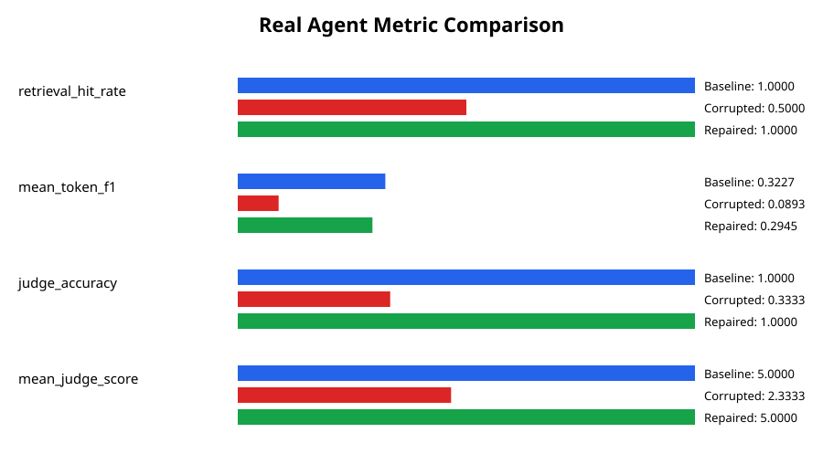

# Corruption and Repair Comparison

## Evaluation comparison

| Metric | Baseline | Corrupted | Repaired | Corruption delta | Repair delta | Recovery |
| --- | ---: | ---: | ---: | ---: | ---: | ---: |
| `retrieval_hit_rate` | 1.0000 | 0.3333 | 1.0000 | -0.6667 | 0.6667 | 1.0000 |
| `mean_token_f1` | 0.6667 | 0.2022 | 0.6667 | -0.4644 | 0.4644 | 1.0000 |
| `judge_accuracy` | 0.6667 | 0.1667 | 0.6667 | -0.5000 | 0.5000 | 1.0000 |
| `mean_judge_score` | 3.6667 | 1.6667 | 3.6667 | -2.0000 | 2.0000 | 1.0000 |

## Real agent comparison

| Metric | Baseline | Corrupted | Repaired |
| --- | ---: | ---: | ---: |
| `retrieval_hit_rate` | 1.0000 | 0.5000 | 1.0000 |
| `mean_token_f1` | 0.3227 | 0.0893 | 0.2945 |
| `judge_accuracy` | 1.0000 | 0.3333 | 1.0000 |
| `mean_judge_score` | 5 | 2.3333 | 5 |
| Judge fallbacks | 0 | 0 | 0 |
| Ragas | {"embedding_model": "sentence-transformers/all-MiniLM-L6-v2", "metrics": {"answer_relevancy": 0.6447051652776783, "context_precision": 0.6666666666, "context_recall": 0.6666666666666666, "faithfulness": 0.6962041226747109}, "model": "o4-mini", "provider": "openrouter", "samples": 6, "status": "passed"} | {"embedding_model": "sentence-transformers/all-MiniLM-L6-v2", "metrics": {"answer_relevancy": 0.7498427757093198, "context_precision": 0.16666666665, "context_recall": 0.16666666666666666, "faithfulness": 0.7583333333333333}, "model": "o4-mini", "provider": "openrouter", "samples": 6, "status": "passed"} | {"embedding_model": "sentence-transformers/all-MiniLM-L6-v2", "metrics": {"answer_relevancy": 0.6008304725288701, "context_precision": 0.6666666666, "context_recall": 0.6666666666666666, "faithfulness": 0.6466049382716049}, "model": "o4-mini", "provider": "openrouter", "samples": 6, "status": "passed"} |

## Quality and freshness signals

| Signal | Baseline | Corrupted | Repaired |
| --- | --- | --- | --- |
| Quality status | **PASS** | **FAIL** | **PASS** |
| Failed checks | 0 | 6 | 0 |
| Warning checks | 1 | 1 | 1 |
| Freshness status | **FRESH** | **STALE** | **FRESH** |
| Stale rows | 0 | 3 | 0 |
| Invalid date rows | 0 | 0 | 0 |

### Failed or warning checks

- Corrupted: `paper_id_unique`, `title_min_length`, `summary_not_null`, `summary_min_length`, `summary_noise_markers`, `freshness_threshold`, `categories_not_null`
- Repaired: `categories_not_null`

## Evidence-based conclusion

Corruption reduced the following recorded metrics: `retrieval_hit_rate`, `mean_token_f1`, `judge_accuracy`, `mean_judge_score`.
Repair improved the following metrics relative to the corrupted state: `retrieval_hit_rate`, `mean_token_f1`, `judge_accuracy`, `mean_judge_score`.
The repaired dataset passes the supplied quality and freshness checks.
